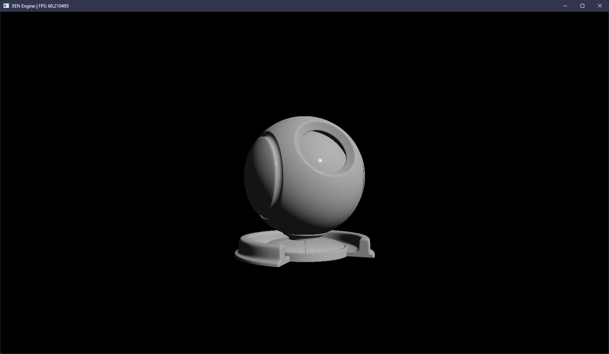

# XEN

**XEN** is a project idea I've had and been working on for a *very* long time: the titular **game
engine**. This repository is my final attempt at realizing that goal.

## Dude, you have like 10 repos named "Xen". What the hell?

Sometimes it's just easier to try again from scratch. One thing those many repos has taught me is
how to structure and organize my C++ projects.

## Okay, so what's the deal with this repo?

As I said above, I want to consolidate all my years of progress into this one project. At this point
I firmly believe if I start over again, XEN will never get finished.

> Simple BRDF implementation.