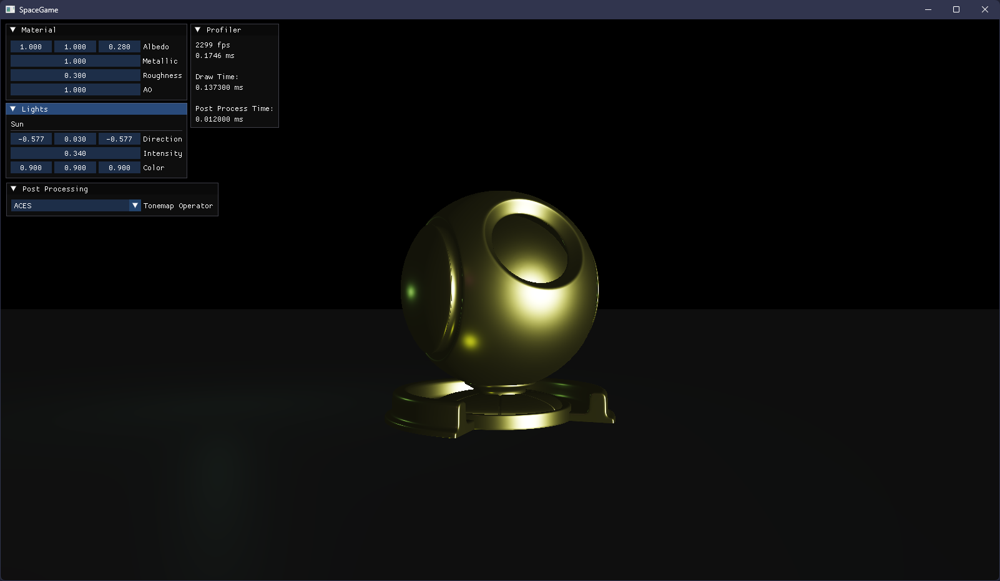

# XEN

**XEN** is a project I've been working on for a *very* long time. *(sigh)* Yes, it's a **game
engine**. This repository is my final attempt at realizing that goal.

## Dude, you have like 10 repos named "Xen". What the hell?

Sometimes it's just easier to try again from scratch.

## Okay, so what's the deal with this repo?

As I said above, I want to consolidate all my years of progress into this one project. At this point
I firmly believe if I start over again, XEN will never get finished.

## Showcase

> Simple BRDF implementation; tone-mapping is being applied via a compute shader in XEN's post
> processing pipeline.