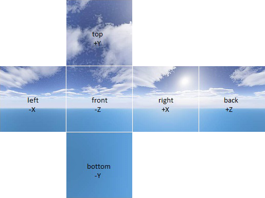

# IBLGen

Internal tool used for precomputing IBL texture maps. It generates the following textures:

- Irradiance map
- Prefiltered environment map (5 mip levels by default)
- BRDF LUT

All cube maps use the following face layout:

All output textures use **16-bit floating point values** with four channels (RGB and alpha).